# 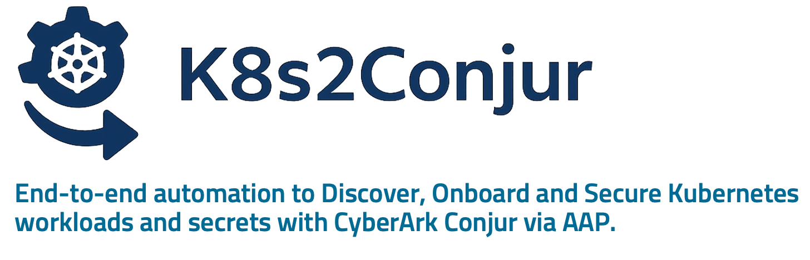

*Created and maintained by [Tudor I. Urdes](https://www.linkedin.com/in/tudor-urdes/), CyberSecurity SME. Connect on [LinkedIn](https://www.linkedin.com/in/tudor-urdes/) for insights and updates.*

**K8s2Conjur is a fully automated onboarding framework** that scans Kubernetes or OpenShift workloads and securely integrates both applications and secrets into **CyberArk Conjur Enterprise**.

K8s2Conjur performs the following steps
- 🔍 Scans workloads (Deployments, StatefulSets) for secrets referenced via environment variables and volumes
- 🔐 Onboards discovered secrets into Conjur with their initial values
- 🏗️ Dynamically generates a **dedicated Host identity and policy** in Conjur to represent the workload
- 📜 Dynamically builds and loads Conjur policies including:
      Variables for each secret
      Access rules linking the workload identity to its secrets
      Scoped permissions for least privilege
- ✅ Create and apply a ConfigMap in the app namespace with Conjur configuration (appliance URL, Conjur public cert, authenticator ID, etc.).
- 🛠️ Automatically patch the Kubernetes deployment to replace hardcoded secrets with Conjur references and inject the CyberArk Secrets Provider as a sidecar.
- 🔐 Create and bound RBAC resources (Role & RoleBinding) that give the Secrets Provider the ability to read and update Kubernetes secrets in the application
- 🔁 Delivers secrets securely both at startup and at runtime via JWT-based authentication using the CyberArk Secrets Provider, which runs continuously alongside 
  the application (side-car container). No hardcoded credentials, no manual secret management required.

<table>
  <tr>
    <td>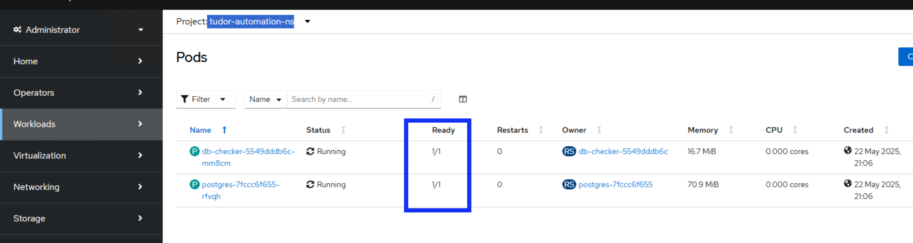</td>
    <td>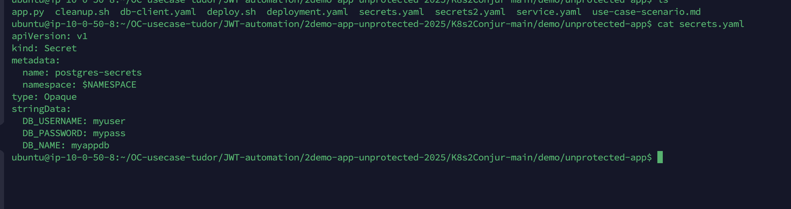</td>
    <td>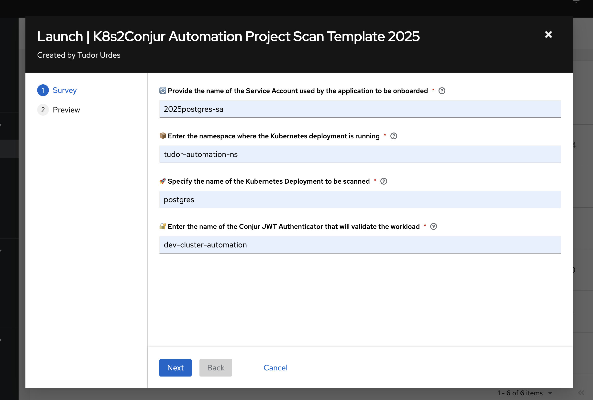</td>
    <td>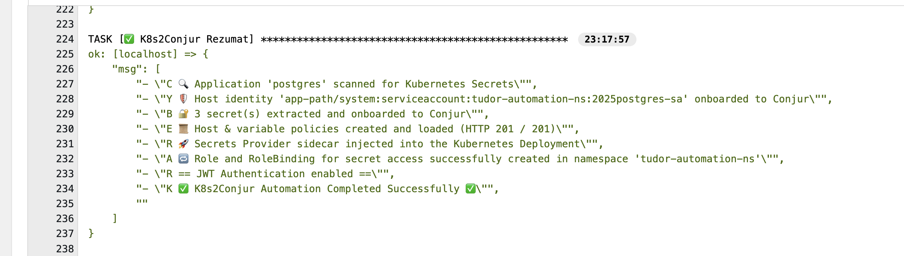</td>
    <td>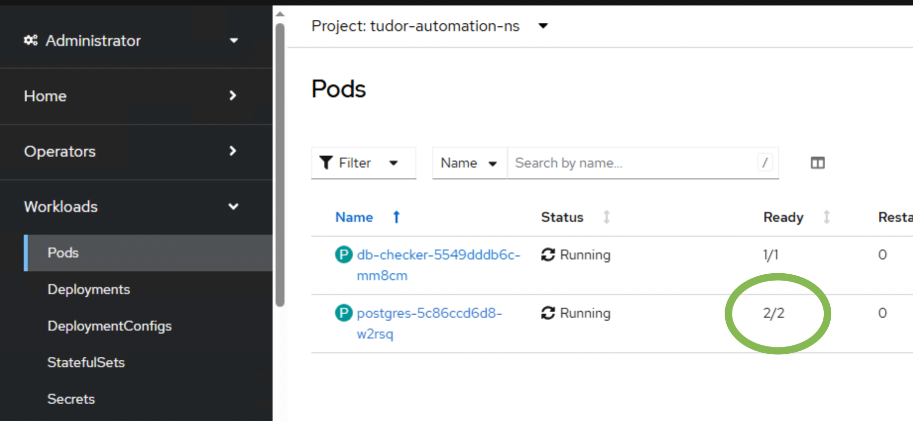</td>
    <td>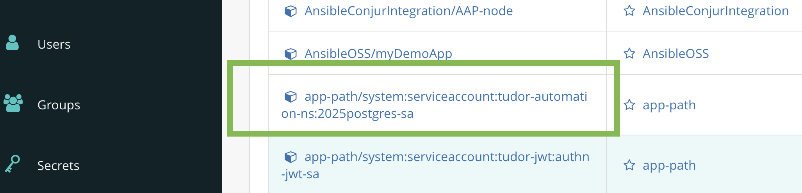</td>
    <td>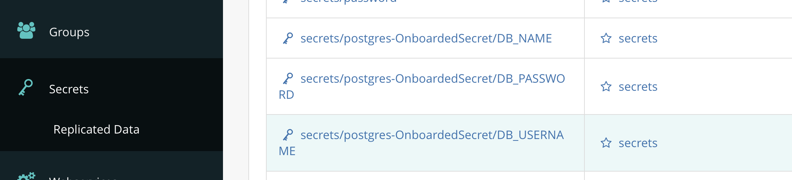</td>
  </tr>
</table>


---
## Changelog
<details> 
  <summary><><><>Click to expand<><><></summary>

# Changelog

| Version  | Date       | Description                                                                 | Key Features                          |
|----------|------------|-----------------------------------------------------------------------------|----------------------------------------|
| v1.0.0   | 2025-05-19 | Initial release of K8s2Conjur automation for scanning Kubernetes secrets and onboarding them to CyberArk Conjur. | Secrets scanning, policy generation, SP injection, dynamic creation of Conjur vars from K8s |
| v1.1.0   | 2025-05-24| Added support for Reloader integration to auto-restart deployments on secret updates. | 🔁 Reloader annotation + Helm install |

---

# 🔀 Feature Matrix

| Feature                        | v1.0.0 | v1.1.0 | 
|--------------------------------|--------|--------|
| Secret Scanning                | ✅     | ✅     | 
| Conjur Policy Generation       | ✅     | ✅     | 
| Inject Secrets Provider        | ✅     | ✅     | 
| Auto-Onboard Secret Values     | ✅     | ✅     | 
| Reloader Integration           | ❌     | ✅     | 
| AI Secret Classification       | ❌     | ❌ TBD    | 
| AI Variable Naming/Annotation  | ❌     | ❌     | 
| AI Run Summary                 | ❌     | ❌     |
</details>
---

📘 Official Documentation

  [What is CyberArk Conjur Enterprise?](https://docs.cyberark.com/conjur-enterprise/latest/en/content/enterprise/enterprise_vs_opensource.htm?tocpath=Get%20started%7C_____3)  
  
  [OpenShift/Kubernetes Integration](https://docs.cyberark.com/conjur-enterprise/latest/en/content/integrations/k8s-ocp/k8s_lp.htm?tocpath=Integrations%7COpenShift%252FKubernetes%7C_____0) 
  
  [JWT Authentication](https://docs.cyberark.com/conjur-enterprise/latest/en/content/operations/services/cjr-authn-jwt-lp.htm?tocpath=Integrations%7CJWT%20Authentication%7C_____0)
  
  [JWT-based Kubernetes authentication](https://docs.cyberark.com/conjur-enterprise/latest/en/content/integrations/k8s-ocp/k8s-jwt-authn.htm)
  
  [SecretsProvider and other methods to securely fetch secrets in K8s; Set up workloads (JWT-based authn)](https://docs.cyberark.com/conjur-enterprise/latest/en/content/integrations/k8s-ocp/k8s-jwt-set-up-apps.htm?tocpath=Integrations%7COpenShift%252FKubernetes%7CApp%20owner%253A%20Set%20up%20workloads%20in%20Kubernetes%7CSet%20up%20workloads%20(JWT-based%20authn)%7C_____0)
  
## Project Overview & Architecture
<details> 
  <summary><><><>Click to expand<><><></summary>

---
### Features: Before and After using the automation
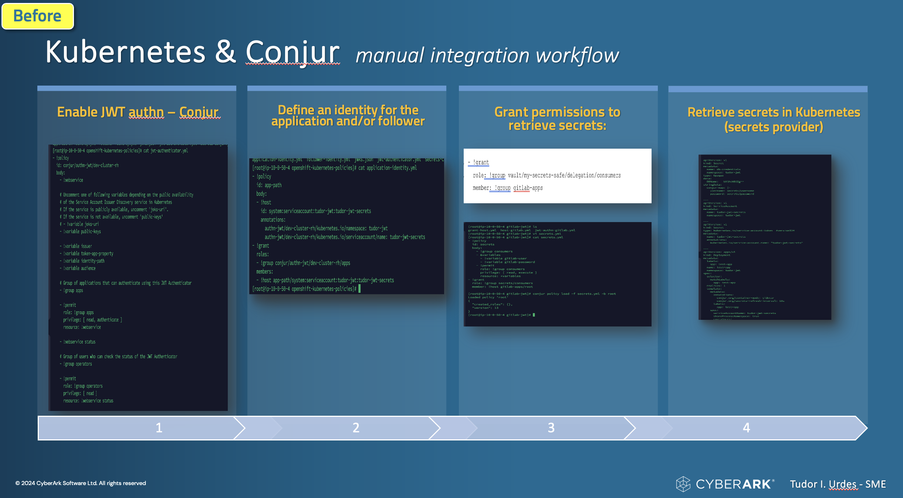
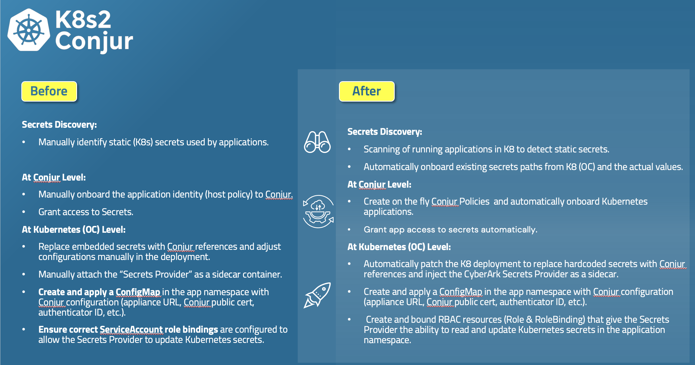

### Steps & Simplified Architecture 

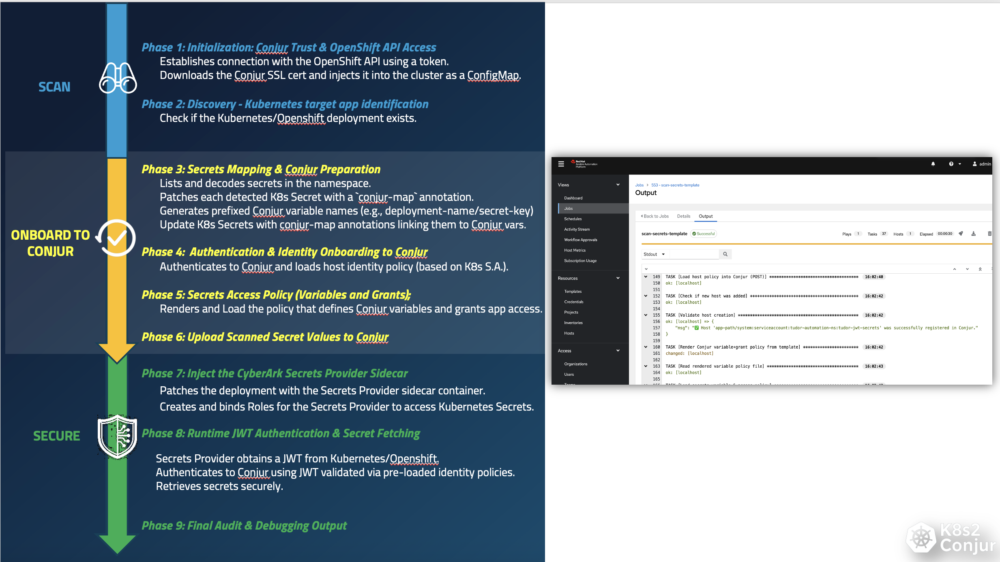
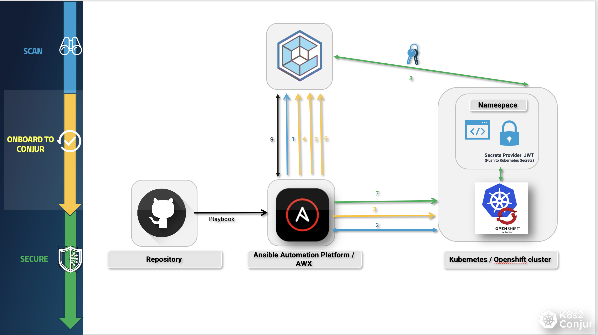

---

</details>

## Prerequisites
<details> 
  <summary><><><>Click to expand<><><></summary>


### ✅ General  
- `conjur` CLI installed  
- `kubectl\oc' or Kubernetes-compatible API client  
-  Conjur admin access for initial configuration.

📘 See: [Conjur CLI Setup Guide]([https://docs.cyberark.com/ConjurCloud-latest/en/Content/ConjurCLI/cli-install.htm](https://docs.cyberark.com/conjur-enterprise/latest/en/content/developer/cli/cli-setup.htm?TocPath=Developer%7CConjur%20CLI%7C_____1)

### ✅ Core Components

-  Access to an OpenShift or Kubernetes cluster  
  - The automation assumes permissions to create:  
    - Deployments  
    - ServiceAccounts  
    - RoleBindings  
    - Secrets
-	The K8s/OC user if he doesn’t have cluster role permissions (super-user) he needs at least to have the following role added:
**  system:service-account-issuer-discovery (ClusterRole permission) **

### 🧰 Machine Requirements (AAP EE or Execution Node)

- ✅ Ansible Automation Platform (AAP) or AWX operational
- ✅ CyberArk Conjur Enterprise with:
  - ✅ **JWT Authenticator enabled and configured** (📌 **one-time setup** per cluster — see [docs/jwt-authenticator.md](docs/jwt-authenticator.md))
  - ✅ A **dedicated non-admin Conjur identity** for the automation (`ansible-automation-user`)
  - ✅ Secrets such as tokens, URLs, and credentials stored as Conjur variables

---

### 🔐 Security Best Practices

- Use a **dedicated Conjur Host identity** for automation access  
- Store sensitive values securely in Conjur:
  - OpenShift/Kubernetes Bearer token
  - API Server endpoint
  - Conjur identity API key
- ✅ Sync those values into AAP using the **official Conjur-AAP integration**
- 📌 The JWT authenticator setup is a required **manual first step per cluster**, and **Step 2** (identity & token injection) is designed as a security layer to **reduce the attack surface** while leveraging secure token fetching

---

---

### 🌐 Network Requirements

| Component                  | Needs Access To | Port | Purpose                                 |
|---------------------------|-----------------|------|-----------------------------------------|
| AAP                       | Conjur          | 443  | Secrets injection, policy operations    |
| AAP                       | OpenShift API   | 443  | Deployment control via API              |
| OpenShift/K8s             | Conjur          | 443  | Secrets Provider JWT-based authentication |

✅ Ensure **DNS resolution** works for both the OpenShift API and Conjur endpoints **from both AAP and OpenShift**.

| Component              | Where it runs                                                    |
| ---------------------- | ---------------------------------------------------------------- |
| `K8s2Conjur.yaml`      | On the Ansible controller or execution environment (`localhost`) |
| Kubernetes API actions | Remote → via HTTPS                                               |
| Conjur API actions     | Remote → via HTTPS                                               |
| SSH or node access     | ❌ Not needed — works entirely via APIs                           |


---

---

### 📦 Required Ansible Collection

Install the `kubernetes.core` collection either via:

`requirements.yml`:
```yaml
collections:
  - name: kubernetes.core

or manually:

```bash

ansible-galaxy collection install kubernetes.core

```

If Reloader needs to be used, install the following

ansible-galaxy collection install community.kubernetes


🔑 Example of retrieving OpenShift API URL & Token
Login to the OpenShift Web Console

Click your user menu → Copy Login Command

Extract:

--token=... → Bearer token

--server=https://... → API URL

Identify your target namespace/project

🔄 Optional: Automate Token Handling
But for most use cases, manual copy-paste of the token is sufficient for the first setup.

</details>

## 📦 Getting Started — Deploy the `K8s2Conjur` Automation
<details>
  <summary><><><>Click to expand<><><></summary>

You can deploy this automation in minutes:

- **Follow step 1+2+3 - one time process**
- (optional - UseCase demo step 4)
- **When step 3 is finished**: **Clone this repository locally** and import it into your AAP/AWX project, **OR**
- Reference the **public GitHub repository** directly as the source in your AAP project: https://github.com/etudurd/K8s2Conjur

---
### 🔧 Required One-Time Preparations

#### 1. ✅ Deploy JWT Authenticator (Manually)

- This is a *security requirement* I used to isolate authentication per cluster. (1 JWT Authn required per K8s Cluster)
- It’s a **one-time setup** and should be created manually for each Kubernetes/OCP cluster.
- Follow the copy-paste-friendly guide here:  
  📄 [`docs/1-jwt-authenticator.md`](docs/1-jwt-authenticator.md)

---
#### 2. 🔐 Secure Connection Between AAP and Conjur

- Also a **one-time process** to safely onboard variables like:
  - `conjur_user` / `conjur_password`
  - `ocp_api_host`, `ocp_token`
- These are securely fetched using a **dedicated identity** (`ansible-automation-user`) to avoid exposing sensitive data.
- As a result, the AAP job template has been simplified from **10 input fields down to 4**.
- Full guide available at:  
  📄 [`docs/2-secure-connection-AAP-integration.md`](docs/2-secure-connection-AAP-integration.md)

---
#### 3. 📦 Set Up AAP Project, Job Template & Survey

- Follow this **one-time setup guide** to manually configure the job template, project, and survey:  
  📄 [`docs/3-improved-manual-setting-up-AAP-template.md`](docs/3-improved-manual-setting-up-AAP-template.md)
- *(An automated installer is coming soon.)*

---
#### ▶️ Run the Automation

Once the setup above is complete, **run** the main playbook:

```bash
From the AAP/AWX GUI -> Template
```
---
---
#### 4. Optional: UseCase Demo [`4-use-case-scenario.md`](./demo/unprotected-app/4-use-case-scenario.md)

</details>

## Use Case Demo: Securing an Unprotected Application

<details>
  <summary><><><>Click to expand<><><></summary>


> 📘 **Full use-case + scripts:** [`4-use-case-scenario.md`](./demo/unprotected-app/4-use-case-scenario.md)

We can demo the solution by deploying an "unprotected" application that includes:
- A **PostgreSQL database container** with three environment variables that should be treated as secrets:
  - `DB_NAME`
  - `DB_USERNAME`
  - `DB_PASSWORD`
- A **client container** that connects to the database using these credentials.

This scenario illustrates how an initially exposed setup can be automatically secured using Conjur and the Secrets Provider (JWT).

### How to Run the Demo

Start the deployment by executing:

```bash
./deploy.sh
```

To clean up all resources deployed during the demo, run:

```bash
./cleanup.sh
```

You can inspect the logs of the two running containers (`postgres` and the client) to verify live communication and credential usage.

### What Happens After Automation

Once the Conjur automation is applied:
- A **Secrets Provider sidecar** is automatically attached to the running PostgreSQL pod
- The Kubernetes Secret references are updated to securely pull values from Conjur using JWT-based authentication
- The corresponding Conjur variables (e.g., `db-name`, `username`, `password`) are created and mapped to the application's workload identity


### How to Verify the Integration

You can confirm that everything worked as expected by:
- Checking that the sidecar container named `cyberark-secrets-provider` is present alongside the database container
- Inspecting the updated Kubernetes Secret objects, which now include Conjur annotations or external references
- Verifying the mappings created in Conjur under the appropriate policy path

### For More Information

To dive deeper into the process, review the this part: [`4-use-case-scenario.md`](./demo/unprotected-app/4-use-case-scenario.md)


</details>

#### ⚠️ Disclaimer
This project is provided for demonstration and educational purposes only.  
It is not officially supported by CyberArk. Use at your own risk and ensure proper validation before deploying in production environments.

🤝 Contributing
Have feedback or want to add support for other clusters?
Feel free to open a pull request or issue.

📜 License
This project is licensed under the MIT License.

