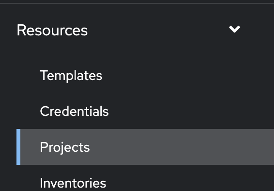
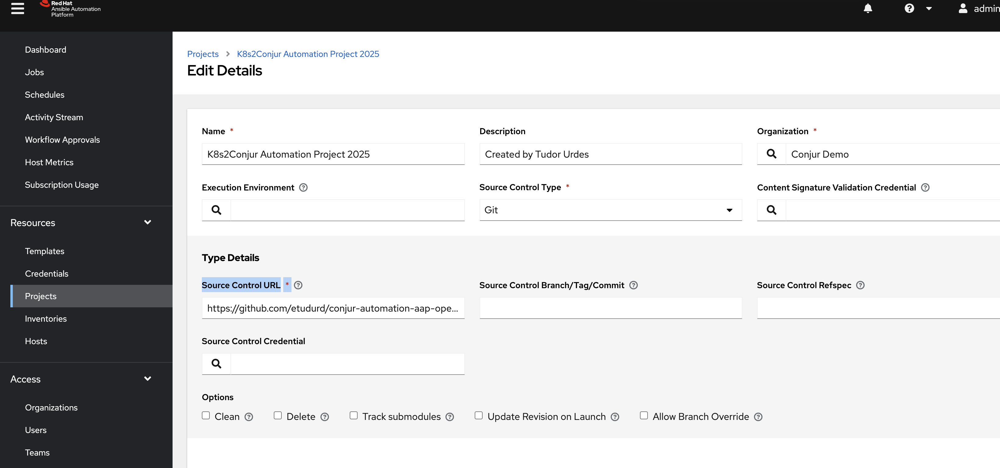
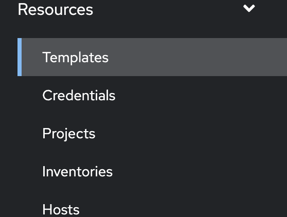
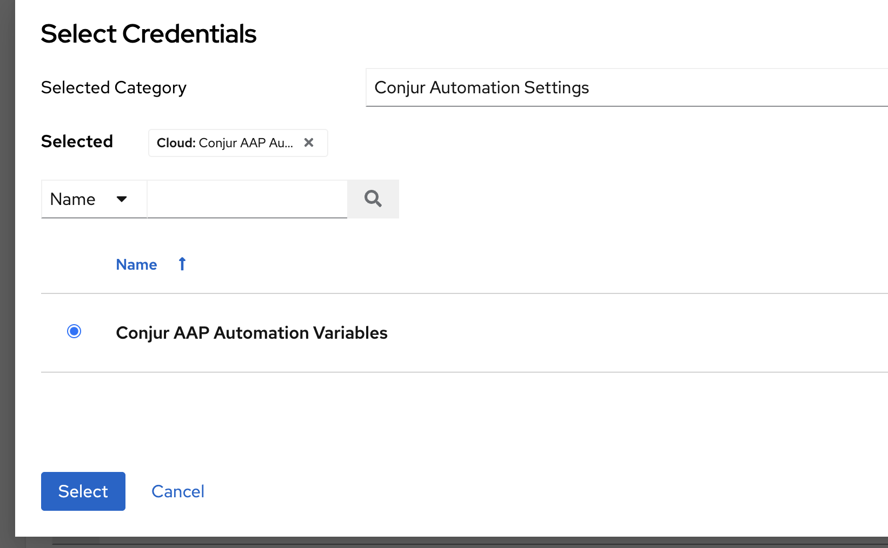
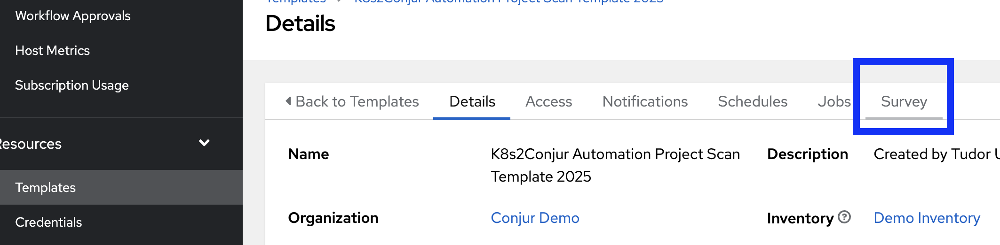
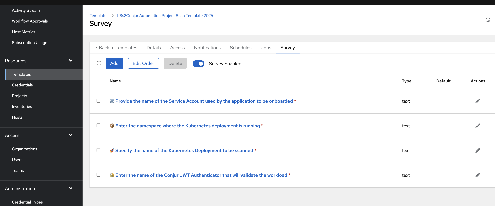
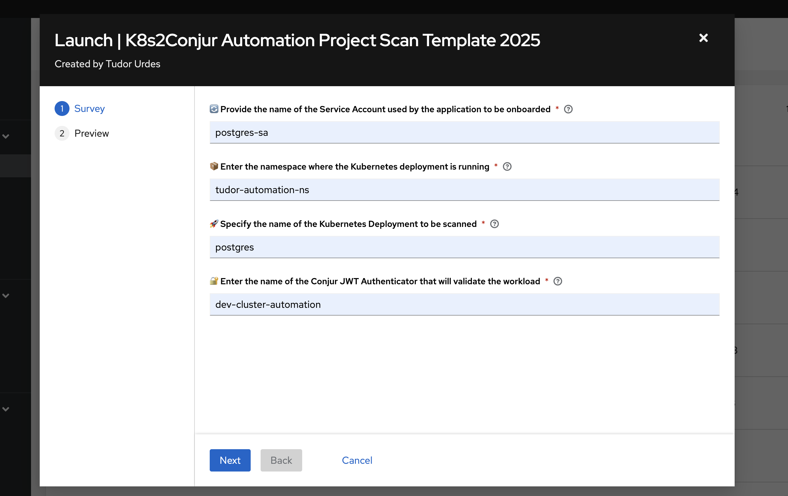
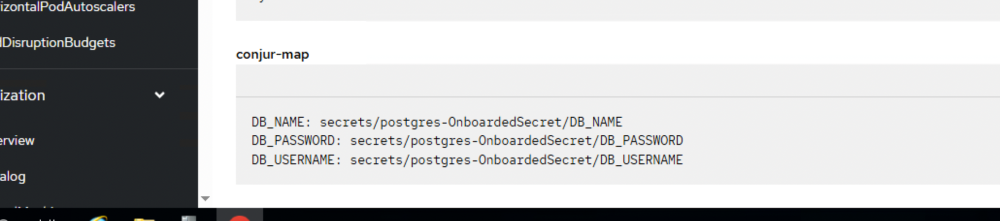

# ⚙️ Manual Setup: AAP Template for Kubernetes-to-Conjur Automation

> 📘 **This is the continuation of Part 2:** [`secure-connection-AAP-integration.md`](./2-secure-connection-AAP-integration.md)

This guide provides step-by-step instructions to manually set up the AAP job template used for:

- 🔍 **Scanning unprotected Kubernetes applications** to identify insecure secret usage
- 🔄 **Dynamically generating Conjur policies** for secrets scanned in Kubernetes workloads
- 🤖 **Automatically onboarding Kubernetes applications into Conjur**, including identity, policies, and secrets
- ⚙️ **Modifying the Kubernetes Deployment on-the-fly** to include proper JWT authentication and Secrets Provider sidecar
- 🔐 **Attaching the CyberArk Secrets Provider** which securely injects secrets into Kubernetes using **JWT-based authentication** from Conjur


By the end of this guide, your AAP environment will be ready to onboard Kubernetes applications into Conjur securely and automatically.

---

## ✅ Step 1: Create a Project in AAP/AWX

> 📂 A project in AAP represents your source control repo which holds your Ansible playbooks.

**Navigation:** Go to **Resources → Projects** and click **Add**



```yaml
Name: K8s2Conjur Automation Project 2025
Description: E2E Automation for Conjur + AAP + OpenShift @TudorUrdes
Organization: Conjur Demo           # 🔄 Replace with your org
Source Control URL: https://github.com/etudurd/K8s2Conjur   # 🔄 Replace with the repo URL
```



> ✅ Once saved, AAP clones the repo and displays available playbooks.

---

## ✅ Step 2: Define a Job Template

> 🧩 A Job Template connects the project, inventory, credentials, and the main playbook.

Navigate to **Resources → Templates**, then click **Add**.



```yaml
Name: K8s2Conjur Automation Project Scan Template 2025
Inventory: Demo Inventory                        # 🔄 Replace with your target inventory
Description: E2E Automation for Conjur Onboarding
Playbook: K8s2Conjur.yaml        | or with K8s2Conjur-Reloader.yaml  which will attach the https://github.com/stakater/Reloader
Credentials: 
    Click 🔍 icon → Choose "Conjur Automation Settings" → Select "Conjur AAP Automation Variables"
```



> 🎯 After saving, the job template becomes available for execution.

---

## ✅ Step 3: Configure the Survey (Dynamic Inputs)

> 📝 Surveys define runtime variables injected into the automation playbook.

Navigate to **Resources → Templates**, click your job template "K8s2Conjur Automation Project Scan Template 2025", then go to the **Survey** tab and add the following fields:



```yaml
Q1: 🔄 Provide the name of the Service Account used by the application to be onboarded 
Description: Used to assign JWT permissions to the application
Variable: service_account

Q2: 📦 Enter the namespace where the Kubernetes deployment is running 
Description: (Used to locate the deployment and secrets)
Variable: k8s_namespace

Q3: 🚀 Specify the name of the Kubernetes Deployment to be scanned
Description: (Used to extract mounted secrets and environment references)
Variable: deployment_name

Q4: 🔐 Enter the name of the Conjur JWT Authenticator that will validate the workload
Description: Conjur JWT authenticator (e.g., authn-jwt/dev-cluster-automation)
Variable: authenticator_id
```



> 💡 Each input will be passed as a variable to the playbook execution.

---

## ✅ Step 4: Run the Automation

Your setup is now complete—no additional steps are required.

Click **Run** on the job template and enter the requested survey values.



> 🟢 The automation will:
> - Scan Kubernetes workloads for mounted secrets
> - Generate and load Conjur policies
> - Inject the Secrets Provider sidecar
> - Patch the Kubernetes deployment
> - Enable secure JWT-based syncing of secrets into Kubernetes




## ✅ Optional: Step 4.1: Run the Automation K8s2Conjur-Reloader
### ♻️ Enable Auto-Redeploy with Reloader (Optional)

If you are running the optional playbook `K8s2Conjur-Reloader.yaml`, this will also attach [**Stakater Reloader**](https://github.com/stakater/Reloader) to your deployment.

**Reloader** is a lightweight Kubernetes controller that **monitors Secrets and ConfigMaps**, and automatically triggers rollouts of associated workloads (Deployments, StatefulSets, etc.) whenever these resources are updated.

---

### 🔍 Why Use Reloader?

In traditional Kubernetes setups:

- Updating a `Secret` or `ConfigMap` does **not** automatically restart or redeploy your workloads.
- This can lead to **stale configurations** and **outdated credentials** being used in production.

**Reloader bridges that gap** by ensuring your workloads stay in sync with configuration changes — automatically and safely.

---

### ✅ Benefits

- ✅ Automatically rolls out workloads on secret/config updates
- 🔁 Keeps deployments in sync with Conjur-managed secrets
- 🛡️ Works seamlessly with Secrets Provider and dynamic secret delivery

---


---

## 📌 Summary

- ✅ Linked Git-based K8s2Conjur project
- ✅ Configured job template with correct credentials
- ✅ Created survey to inject dynamic runtime values
- ✅ Fully prepared AAP to trigger secure Kubernetes-to-Conjur onboarding with Secrets Provider integration
