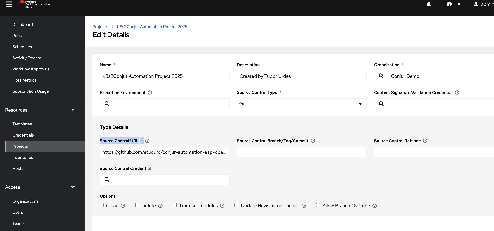
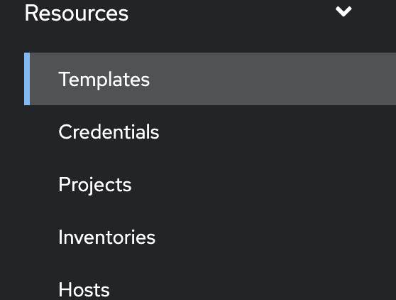
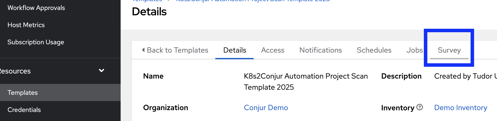
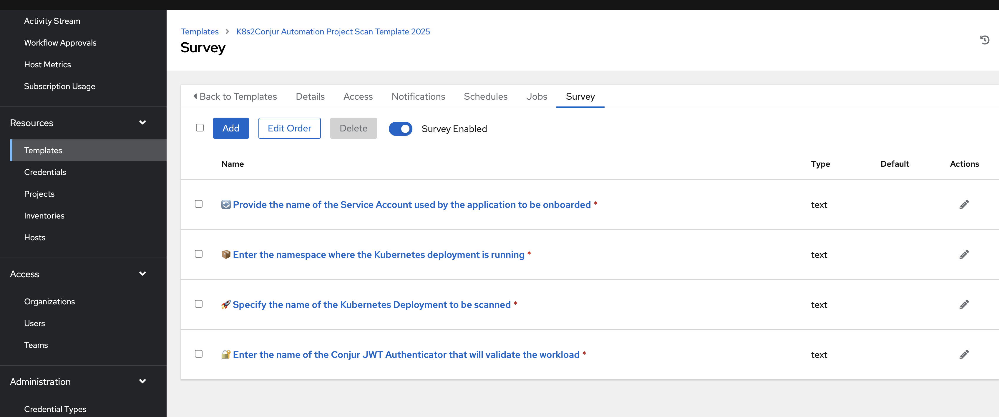

# ⚙️ Configuring the Automation

Supposing the Plugin was defined and the connection between AAP and Conjur was secured.

# Step 1 Create a Project in AAP/AWX

**🔴⬇️	 **Ansible Side** ⬇️🔴**

Navigate to **Resources -> Projects** and press **Add** 


```yaml

Name: K8s2Conjur Automation Project 2025
Description: E2E Automation Conjur+AAP+OC Tudor Urdes
Organization: Conjur Demo # replace with yours
Source Control URL: ProjectAddress

```



# Step 2 Define the Template

Navigate to **Resources -> Templates** and press **Add** 



```yaml

Name: K8s2Conjur Automation Project Scan Template 2025
Inventory: Demo Inventory #replace with your own inventory
Description: E2E Automation Conjur+AAP+OC Tudor Urdes
Playbook: K8s2Conjur.yaml
Credentials: Press on the loop -> Selected Category -> "Conjur Automation Settings" -> "Conjur AAP Automation Variables" 

```


**Output**


# Step 3 Configure the Survey

Navigate to **Resources -> Templates** -> Press on the template K8s2Conjur Automation Project Scan Template 2025 -> Survey and define the following fields



```yaml
Q1: 🔄 Provide the name of the Service Account used by the application to be onboarded 
Description: (This is required for assigning JWT permissions to your app)
Answer variable name: service_account

Q2: 📦 Enter the namespace where the Kubernetes deployment is running 
Description: (Used to locate the deployment and secrets)
Answer variable name: k8s_namespace

Q3:  🚀 Specify the name of the Kubernetes Deployment to be scanned
Description: (Used to extract mounted secrets and environment references)
Answer variable name: deployment_name

Q4: 🔐 Enter the name of the Conjur JWT Authenticator that will validate the workload
Description: (e.g., authn-jwt/dev-cluster-automation)
Answer variable name: authenticator_id

```


# Step 3 Run the Automation and fill the requested details


