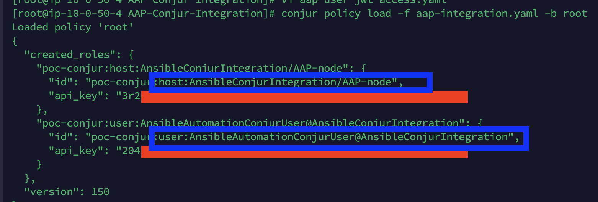
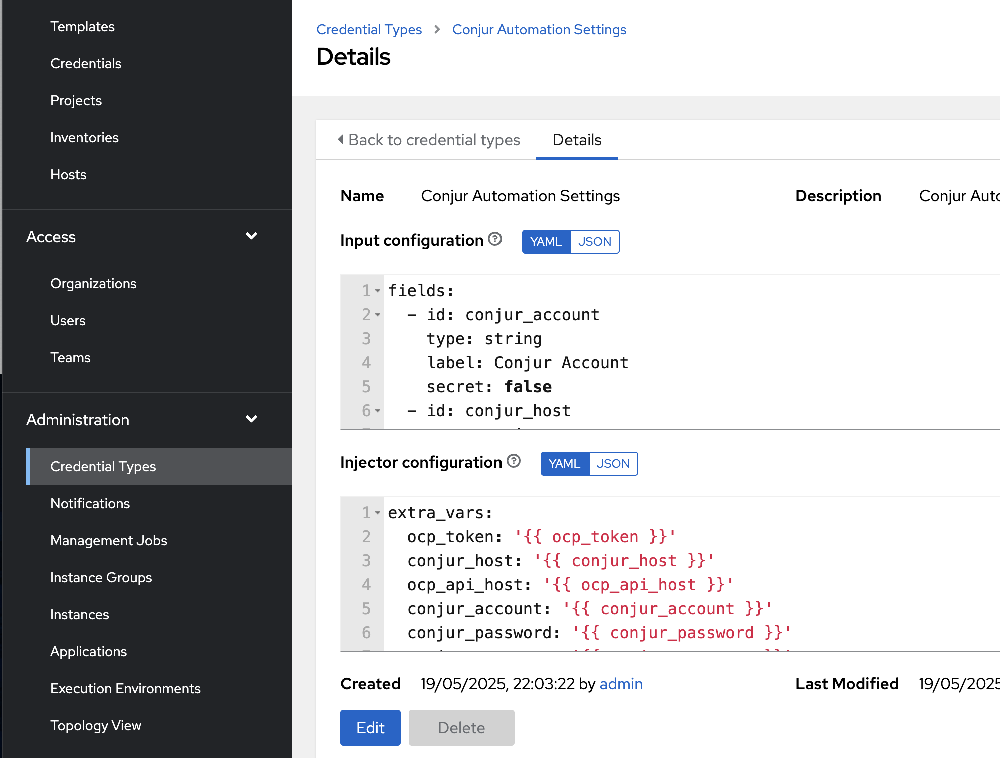
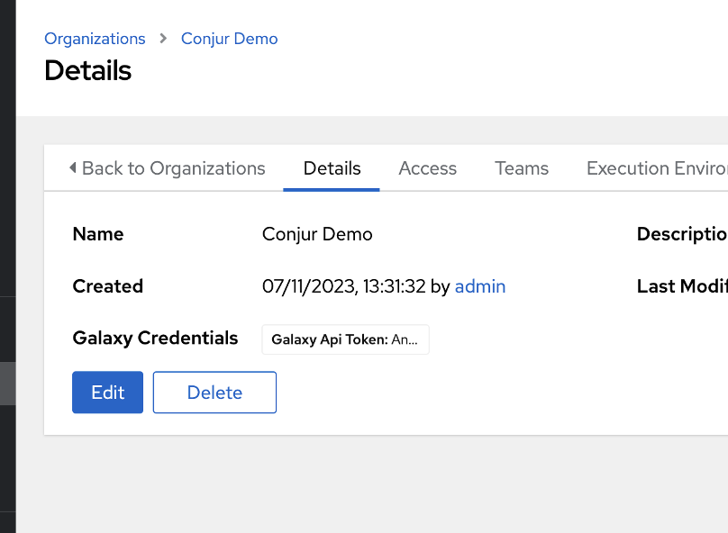
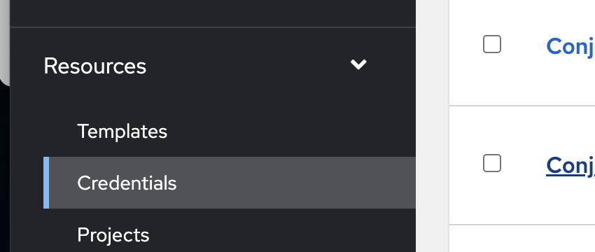
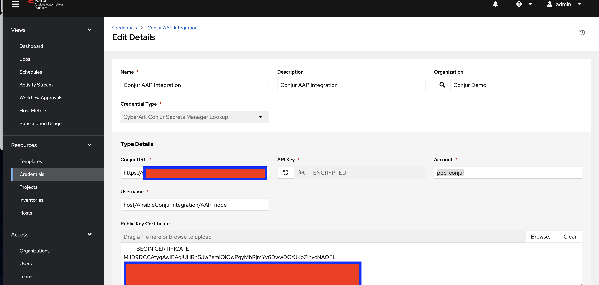
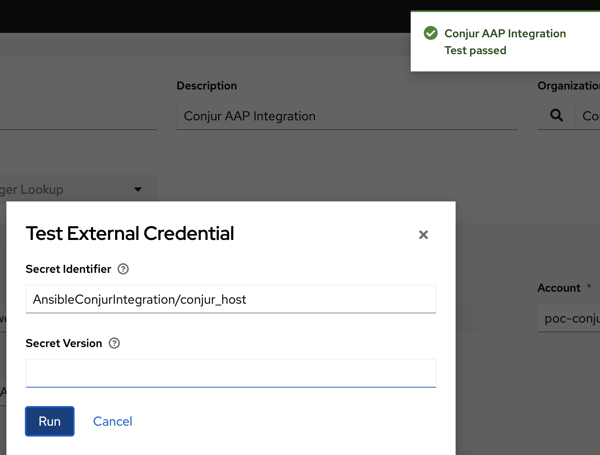
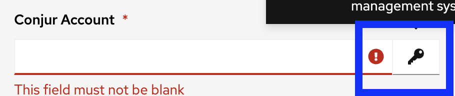
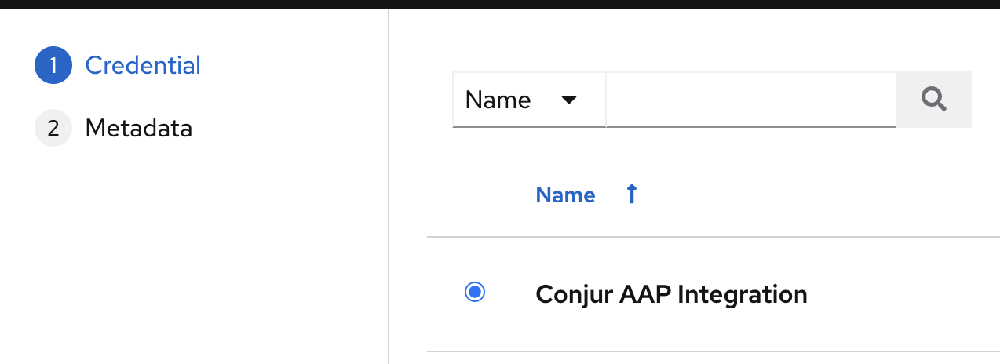
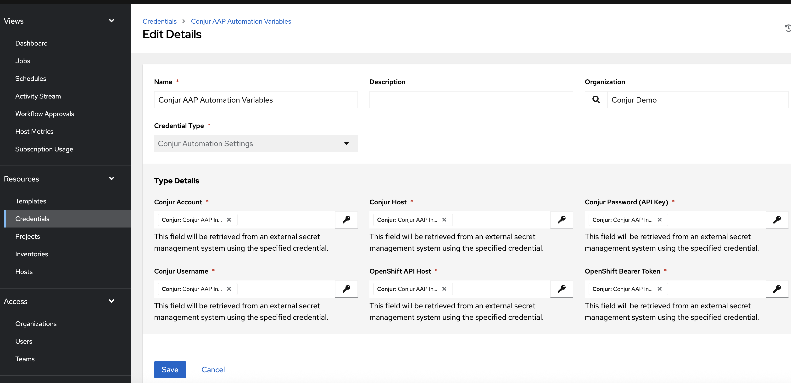

# 🛡️ Ansible ↔️ Conjur Integration Policy
Note: To enhance the security of the automation,** we leverage the established integration between Ansible Automation Platform (AAP) and Conjur.** This allows **AAP to securely retrieve required variables through a dedicated, non-admin identity** (ansible-automation-user). This identity is used to run Conjur commands and manage policies without exposing sensitive credential**s. All secrets needed by the automation have been securely onboarded into Conjur, enabling AAP to access them seamlessly. As a result, the number of input fields in the automation template has been reduced from 10 to just 4**, removing the need to manually enter Conjur credentials, OCP tokens, or other sensitive data, and significantly reducing the risk of exposure while simplifying the overall workflow.


# Step 1 Secure both AAP/AWX and the K8s2Conjur Automation

🔷⬇️ CyberArk Conjur Side ⬇️🔷

Login to Conjur by using the CLI

---

## 🔐 Conjur Policy (YAML)

```yaml
- !policy
  id: AnsibleConjurIntegration
  body:
    # Define the human identity (user) that automation uses to authenticate to Conjur via API key
    - !user AnsibleAutomationConjurUser

    # Define the machine identity (host) representing the AAP node or execution environment
    - !host AAP-node

    # Define variables that store credentials and configuration values
    - &variables
      - !variable ocp_api_host        # OpenShift or Kubernetes API endpoint
      - !variable conjur_account      # Conjur account name (e.g., 'default')
      - !variable conjur_host         # Conjur appliance URL
      - !variable conjur_username     # Conjur username used by automation
      - !variable conjur_password     # Conjur user API key
      - !variable ocp_token           # OpenShift Web Console Bearer token

    # Permissions for the automation user to manage these variables
    - !permit
      role: !user AnsibleAutomationConjurUser
      privileges: [ read, update, execute ]
      resources: *variables

    # Permissions for the AAP host to only read and execute the variables
    - !permit
      role: !host AAP-node
      privileges: [ read, execute ]
      resources: *variables

    # Optional: internal group definition if you want to reuse inside this policy
    #- !group local-admins

    # Add the user to local-admins for future extensibility
    #- !grant
    #  role: !group local-admins
    #  members:
    #    - !user AnsibleAutomationConjurUser


```

And save the output as "aap-integration.yaml" and run the following command: 

```bash
conjur policy load -f aap-integration.yaml -b root
```




Save the output. As we can observe, **two API keys are generated: one for configuring the Ansible plugin to connect with the Conjur Leader/Follower. **(host:AnsibleConjurIntegration/AAP-node), a**nd another for the automation itself to interact with the Conjur API and onboard the scanned Kubernetes deployments** (user:AnsibleAutomationConjurUser@AnsibleConjurIntegration). 

## 🔐 Grant Access to the AnsibleAutomationConjurUser to the JWT authenticator - which is linked to Root Branch, not incapsulated in the policy above (YAML)


```yaml
- !group admins
- !permit
  role: !group admins
  privileges:
    - create
    - update
    - read
  resources:
    - !policy root
- !grant
  role: !group admins
  members:
    - !user AnsibleAutomationConjurUser@AnsibleConjurIntegration
```                                         

Save the policy above as: ** aap-user-jwt-access.yaml ** and run:
```bash
conjur policy load -f aap-user-jwt-access.yaml -b root
```

# Step 2 Inject the connection values to the variables created above:

🔷⬇️ CyberArk Conjur Side ⬇️🔷

From the Conjur CLI run the following commands:

```bash

conjur variable set -i AnsibleConjurIntegration/conjur_account -v poc-conjur    #replace poc-conjur with your Conjur account name

conjur variable set -i AnsibleConjurIntegration/conjur_host -v ec2<>.compute.amazonaws.com  #replace with your Conjur Leader/Follower DNS address

#replace with the API key resulted after applying the first policy - associated with the user AnsibleAutomationConjurUser@AnsibleConjurIntegration

conjur variable set -i AnsibleConjurIntegration/conjur_password -v 2041APIKEY  

conjur variable set -i AnsibleConjurIntegration/conjur_username -v AnsibleAutomationConjurUser@AnsibleConjurIntegration

conjur variable set -i AnsibleConjurIntegration/ocp_api_host -v api.cluster.emea-lab.cybr:6443   #replace with your Openshift/K8 Server address

conjur variable set -i AnsibleConjurIntegration/ocp_token -v sha256~<><><><5ziWWLbg  #replace with your Openshift/K8 API token

```

# Step 3 Configure AAP/AWX - Conjur Plugin

**🔴⬇️	 **Ansible Side** ⬇️🔴**

## A. Administration -> Credential Types

Navigate to Administration → Credential Types in the AAP/AWX UI to perform this configuration.


Click on "Add" and Fill the form as:

**Name**: Conjur Automation Settings

**Description**: Conjur Automation Connection Parameters

And for **Input Configuration** + **Injector** **Configuration** copy/paste the following: 

**Press Save. **

**Input configuration Yaml:**

```yaml

fields:
  - id: conjur_account
    type: string
    label: Conjur Account
    secret: false
  - id: conjur_host
    type: string
    label: Conjur Host
    secret: false
  - id: conjur_password
    type: string
    label: Conjur Password (API Key)
    secret: true
  - id: conjur_username
    type: string
    label: Conjur Username
    secret: false
  - id: ocp_api_host
    type: string
    label: OpenShift API Host
    secret: false
  - id: ocp_token
    type: string
    label: OpenShift Bearer Token
    secret: true
required:
  - conjur_account
  - conjur_host
  - conjur_password
  - conjur_username
  - ocp_api_host
  - ocp_token

```

**Injector Configuration Yaml** 

```yaml
extra_vars:
  ocp_token: '{{ ocp_token }}'
  conjur_host: '{{ conjur_host }}'
  ocp_api_host: '{{ ocp_api_host }}'
  conjur_account: '{{ conjur_account }}'
  conjur_password: '{{ conjur_password }}'
  conjur_username: '{{ conjur_username }}'
```
Output: 



## B. Configure a new AAP/AWX Organization (Optional)

Work will be done at AAP/AWX UI under Access -> Organizations, 
1. Click Add
2. Fill the form

Name: Conjur Demo




## C. Configure CyberArk Conjur Secrets Manager Lookup Plugin

Navigate to **Resources -> Credentials** and press **Add**



Search for **Credential Type: CyberArk Conjur Secrets Manager Lookup**
And fill the fields accordingly: 

```yaml

Name: Conjur AAP Integration
Description: Conjur AAP Integration
Organization: Conjur Demo #replace with your own organization
Credential Type: CyberArk Conjur Secrets Manager Lookup
Conjur URL: https://<Replace-with-CONJUR-LEADER DNS address>.com
Username: host/AnsibleConjurIntegration/AAP-node
API Key: copy the API key resulted after applying the first policy above associated to host/AnsibleConjurIntegration/AAP-node identity (not the AnsibleUser)
Public Key Certificate: # Copy the contents of your Conjur public key
Account: poc-conjur  #replace with your Conjur Leader/Instance account name 

```
**!Note: you can retrieve the Conjur public key by running a command like**

```bash
openssl s_client -showcerts -connect <Replace-with-CONJUR-LEADER-DNS-address>.com:443 < /dev/null 2> /dev/null | sed -ne '/-BEGIN CERTIFICATE-/,/-END CERTIFICATE-/p' > conjur.pem
```
**Output:**


Press Test and Save 

### Optional: Test Connection

Click the Test button and replace the value with the path of a variable defined in your CyberArk Conjur policy — for example: AnsibleConjurIntegration/conjur_host  + Run





## D. Configure Conjur Secrets credential Mapping


Navigate to **Resources -> Credentials** and press **Add** 

Search for **Credential Type: Conjur Automation Settings**

And fill the fields accordingly: 

```yaml
Name: Conjur AAP Automation Variables
Organization: Conjur Demo #replace with your own organization
Credential Type: CyberArk Conjur Secrets Manager Lookup
```

**Click on the key icon next to the listed Path input boxes.**


**Select Conjur AAP integration**



**And for each variable select the corresponding Path retrieved from Conjur, for example:**
```bash
Conjur Account: AnsibleConjurIntegration/conjur_account
Conjur Host: AnsibleConjurIntegration/conjur_host
Conjur Password (API Key): AnsibleConjurIntegration/conjur_password
Conjur Username: AnsibleConjurIntegration/conjur_username
OpenShift API Host: AnsibleConjurIntegration/ocp_api_host
OpenShift Bearer Token: AnsibleConjurIntegration/ocp_token
```

**Output:**


